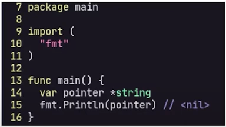
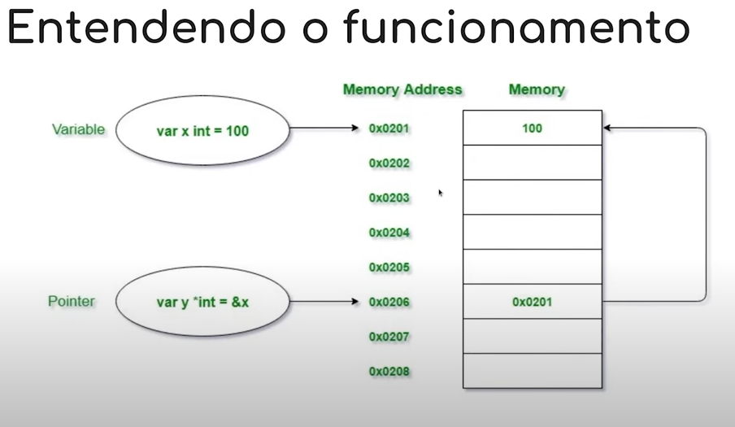
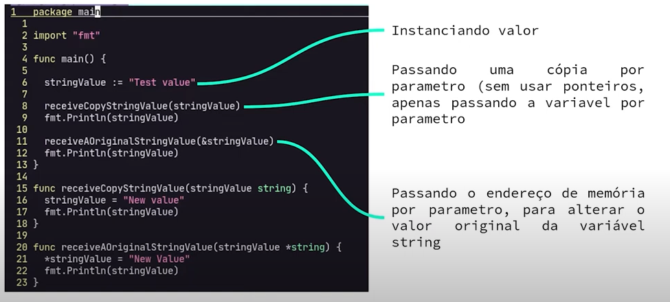

# Introdução à ponteiros em Go

## O que são ponteiros em go?

## Porque usar ponteiros?

## Os operadores * e &

## "Zero-values" e ponteiros nulos em go

## Entendendo o funcionamento

## Exemplo

[video do HunCoding](https://www.youtube.com/watch?v=FLIWsfS9gTg&ab_channel=HunCoding)